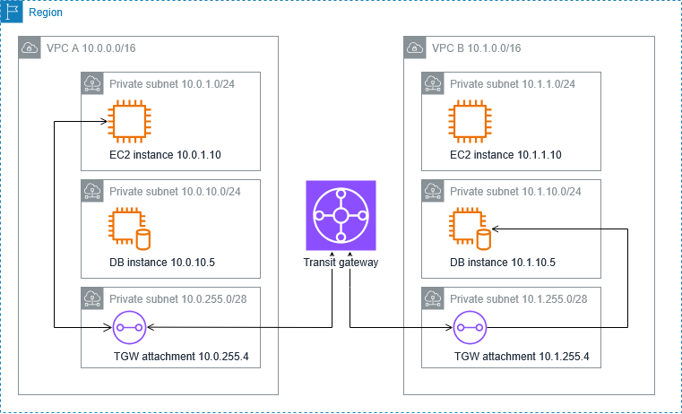

# Transit Gateway Demo Testing Guide

This guide shows how to test the Transit Gateway connectivity created by the `tgw-cf.yaml` CloudFormation template.

## Overview



Two VPCs connected via Transit Gateway. EC2 instances can communicate across VPCs through TGW attachments.

**Requirements:** This template creates 2 VPCs - ensure you have VPC quota availability in your AWS account.

## Prerequisites

- AWS CLI configured with appropriate permissions
- EC2 key pair (create one if needed):

```
aws ec2 create-key-pair --key-name tgw-demo-key
```

## Deployment

Deploy the CloudFormation template:

```
aws cloudformation create-stack \
  --stack-name tgw-demo-stack \
  --template-body file://tgw-cf.yaml \
  --parameters ParameterKey=KeyPairName,ParameterValue=tgw-demo-key \
  --capabilities CAPABILITY_IAM
```

Wait for deployment to complete (~5 minutes):
```bash
aws cloudformation describe-stacks --stack-name tgw-demo-stack --query 'Stacks[0].StackStatus'
```

## Cost Warning

- **Transit Gateway Attachments:** ~$72/month if left running
- **Demo Cost:** Deploy → Test → Delete same day = ~$0.25 total
- **VPC Reachability Analyzer:** $0.10 per test
- **Delete immediately:** Total cost under $1 for quick demo

## Testing with VPC Reachability Analyzer

1. **Navigate to VPC Console**
   - Go to AWS Console → VPC → Reachability Analyzer

2. **Create Network Path**
   - Click "Create and analyze path"
   - **Source:** EC2-Instance-VPC-A
   - **Destination:** EC2-Instance-VPC-B
   - **Protocol:** TCP

3. **Run Analysis**
   - Click "Create and analyze path"
   - Wait 30-60 seconds for results

## Expected Results

**Successful Path:**
```
EC2-Instance-VPC-A → VPC-A Route Table → TGW Attachment → 
Transit Gateway → TGW Attachment → VPC-B Route Table → EC2-Instance-VPC-B
```

## Troubleshooting

If "Not Reachable":
1. Check security groups allow TCP traffic on port 22
2. Verify route tables have TGW routes
3. Confirm TGW attachments are "Available"

## Cleanup

```bash
aws cloudformation delete-stack --stack-name tgw-demo-stack
```

**Delete immediately after testing to avoid ongoing charges.**
