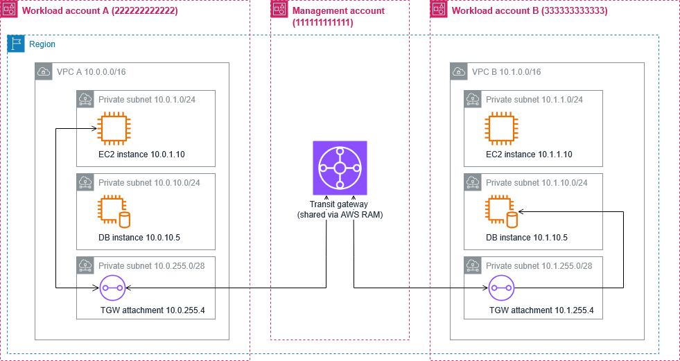

# Multi-account Transit Gateway demo (single-account simulation)

> **Demo Structure**: This is deployed in a single AWS account using tagging to simulate multi-account patterns. It demonstrates Transit Gateway networking concepts for production multi-account environments. For complete multi-account guidance, see the [AWS Multi-Account Architecture whitepaper](https://docs.aws.amazon.com/whitepapers/latest/organizing-your-aws-environment/organizing-your-aws-environment.html).

## Problem statement

AWS Transit Gateway documentation is primarily written for single-account scenarios, but multi-account architectures are common. This creates a gap between how networking concepts are documented and how customers actually deploy them.

I verified this finding with a senior AWS Solutions Architect and he noted: *"All of the customers I talk to are multi-account and this can help reduce the burden on me and my peers by removing ambiguity that we must disambiguate through 1:1 engagements."*

This demo bridges that gap by showing how Transit Gateway concepts translate to multi-account patterns.

## Multi-account architecture overview



The architecture demonstrates Transit Gateway enabling cross-account VPC connectivity within a single region, with the TGW shared from the Management Account via Resource Access Manager (RAM) to workload accounts.

## Architecture benefits demonstrated

### 1. **Account isolation**
- **Management account**: AWS Organizations, billing, and infrastructure services (TGW)
- **Workload account A (10.0.0.0/16)**: Application and database resources
- **Workload account B (10.1.0.0/16)**: Application and database resources

### 2. **Network segmentation**
- Separate CIDR blocks prevent IP conflicts
- Cross-account routing through Transit Gateway
- Security groups enforce different access patterns per environment

### 3. **RAM sharing prerequisite**
The Transit Gateway must be shared from the Management Account to Workload Accounts via Resource Access Manager before VPC attachments can be created. This enables cross-account connectivity while maintaining centralized TGW management.

## Real-world implementation

In a production multi-account setup, this architecture would be deployed using separate CloudFormation templates for each account, with the Management Account creating and sharing the Transit Gateway via RAM, and workload accounts accepting the share to create VPC attachments.

The `tgw-cf-multi-account.yaml` template in this repository demonstrates the complete infrastructure pattern, including multi-account tagging and security group strategies.

## Prerequisites

- AWS CLI configured with appropriate permissions
- EC2 key pair for instance access (you can get existing key pairs with `aws ec2 describe-key-pairs`)
- Available VPC capacity (creates 2 VPCs - default limit is 5 per region)
- Understanding of multi-account networking concepts

## Deployment

Deploy the multi-account simulation:

```bash
aws cloudformation create-stack \
  --stack-name multi-account-tgw-demo \
  --template-body file://tgw-cf-multi-account.yaml \
  --parameters ParameterKey=KeyPairName,ParameterValue=your-key-pair \
  --capabilities CAPABILITY_IAM \
  --region us-east-2
```

Monitor deployment:
```bash
aws cloudformation describe-stacks \
  --stack-name multi-account-tgw-demo \
  --query 'Stacks[0].StackStatus'
```

## Testing cross-account connectivity

### 1. VPC reachability analyzer test (console)
- **Source**: Workload-A-Instance (10.0.1.10)
- **Destination**: Workload-B-Instance (10.1.1.10)
- **Expected Result**: Reachable via Transit Gateway

### 2. Security group validation
- Workload A instance has restrictive access (only from Workload B CIDR)
- Workload B instance demonstrates different access patterns

### 3. Cross-account route verification
```bash
# Check route tables show cross-account routes
aws ec2 describe-route-tables \
  --filters "Name=tag:Account-Role,Values=Workload-A" \
  --query 'RouteTables[*].Routes[?DestinationCidrBlock==`10.1.0.0/16`]'
```

## Cleanup

```bash
aws cloudformation delete-stack --stack-name multi-account-tgw-demo
```

## Next steps

To implement this as a true multi-account architecture:

1. Set up AWS Organizations with appropriate OUs
2. Create separate AWS accounts for each role
3. Deploy infrastructure template in Management account
4. Set up RAM sharing for Transit Gateway
5. Deploy workload templates in respective accounts
6. Configure cross-account IAM roles and policies

This demo provides the foundation for understanding multi-account networking patterns that scale to enterprise environments.
